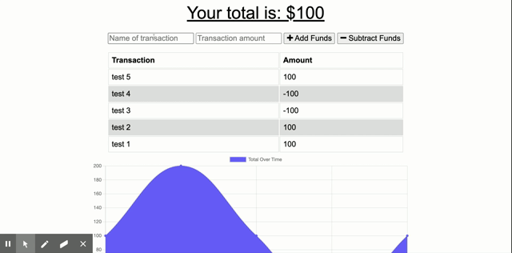

# Budget Tracker

## Table of Contents

* [Description](#description)
* [Installation Instructions](#installation-instructions)
* [Usage Information](#usage-information)
* [Contribution Guidelines](#contribution-guidelines)
* [Test Instructions](#test-instructions)
* [Licenses](#licenses)
* [Questions](#questions)
## Description
This is a progressive web application that allows users to track their budgets online and offline.
## Installation Instructions
N/A
## Usage Information
To properly use this application, the user can input any budget income or expense and the ammount of the expense and the application will store that information in the database whether the information is submitted online or offline.
## Contribution Guidelines
N/A
## Test Instructions
N/A
## Licenses

## Questions
[seahopki12](https://github.com/seahopki12)

<seahopki12@gmail.com>

<https://mighty-citadel-30004.herokuapp.com/>